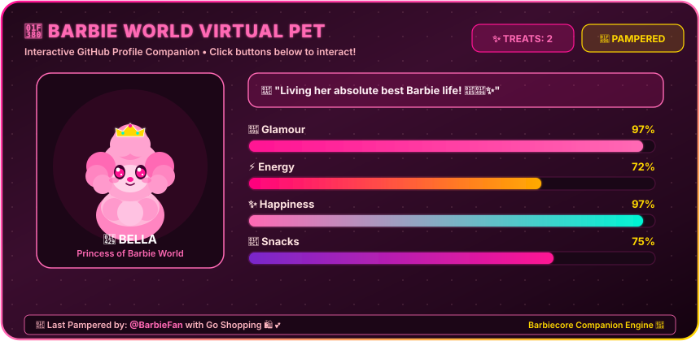

<!-- Animated Header -->
<p align="center">
  
</p>


<!-- Typing Animation -->
<div align="center">
  
</div>

<br/>

<!-- Quick GitHub Stats Badges -->
<div align="center">
  <a href="https://github.com/afifasyed123">
    
  </a>
  &nbsp;
  <a href="https://github.com/afifasyed123?tab=followers">
    
  </a>
  &nbsp;
  <a href="https://github.com/afifasyed123?tab=repositories">
    
  </a>
  &nbsp;
  <a href="https://linkedin.com/in/afifa-syed-41a770260/">
    
  </a>
  &nbsp;
  <a href="https://afifa-syed-portfolio.vercel.app/">
    
  </a>
</div>

<br/>

<table align="center" border="0" cellspacing="0" cellpadding="0">
</table>

<br/>

---

## 🎯 About Me

```typescript
const afifa = {
    identity: "Afifa Syed",
    pronouns: "She" | "Her",
    location: "Mumbai, India 🇮🇳",
    education: {
        degree: "B.E. in Artificial Intelligence & Data Science",
        college: "Thadomal Shahani Engineering College (TSEC '28)",
        cgpa: "9.62 / 10.00",
        diploma: "Diploma in Computer Engineering (MHSS Polytechnic) — 93.60%"
    },
    
    currentFocus: [
        "Scalable Backend Architectures in Java & Spring Boot",
        "Machine Learning Pipelines, EDA & Statistical Modeling in Python",
        "Algorithmic Problem Solving (Data Structures & Algorithms)",
        "Enterprise Database Persistence & RESTful API Engineering"
    ],

    academicHonors: [
        "🏆 9.62 CGPA — Artificial Intelligence & Data Science @ TSEC Mumbai",
        "🥇 93.60% — Diploma in Computer Engineering @ M.H. Saboo Siddik Polytechnic",
        "📜 Infosys Springboard Certified — Data Science & Machine Learning",
        "🎖️ Suven Consultants Internship — C++ Programming & Problem Solving",
        "🌟 NPTEL Certified — Design Thinking: A Primer"
    ],
    
    code: ["Java", "Python", "SQL", "C++", "C", "JavaScript", "HTML/CSS"],
    
    technologies: {
        backend: ["Spring Boot", "Spring Data JPA", "Hibernate", "Servlets & JSP", "JDBC", "REST APIs", "Maven"],
        aiAndDataScience: ["Scikit-Learn", "Pandas", "NumPy", "TensorFlow", "OpenCV", "Matplotlib", "Jupyter Notebook"],
        database: ["MySQL", "Relational Schema Design", "Query Optimization"],
        frontend: ["HTML5", "CSS3", "JavaScript (ES6+)", "React.js", "Thymeleaf", "JSP"],
        toolsAndPlatforms: ["Git", "GitHub", "IntelliJ IDEA", "VS Code", "Postman", "Linux", "Windows"]
    },
    
    funFact: "I can design normalized SQL database schemas AND train predictive ML classifiers in the same sprint! 💖⚡",
    askMeAbout: ["Spring Boot", "Java OOPs", "Machine Learning in Python", "DSA", "Relational Databases"],
    challenge: "Building resilient, elegant, and high-performance software systems with clean architecture"
};
```

---

## 🏆 Featured Flagship Builds


<table width="100%">
<tr>
<td width="50%" valign="top">

### 🗂️ [Task Management System](https://github.com/afifasyed123/Task-Management-System)
`Java` • `Spring Boot` • `Spring Data JPA` • `Hibernate` • `MySQL` • `Thymeleaf`
* Full-featured MVC enterprise task tracking application with complete CRUD lifecycle.
* Implements dynamic priority scoring, deadline monitoring, and custom relational queries.
* **[GitHub Repository](https://github.com/afifasyed123/Task-Management-System)**

</td>
<td width="50%" valign="top">

### 🎓 [Student Management System](https://github.com/afifasyed123/student-management-system)
`Java` • `Servlets` • `JSP` • `JDBC` • `MySQL` • `MVC Architecture`
* Dynamic academic record management platform built with secure database persistence.
* Features modular Controller-View separation, relational integrity, and automated schema migration.
* **[GitHub Repository](https://github.com/afifasyed123/student-management-system)**

</td>
</tr>
<tr>
<td width="50%" valign="top">

### 💖 [Barbie World Portfolio](https://afifa-syed-portfolio.vercel.app/)
`Next.js` • `TypeScript` • `Tailwind CSS` • `Framer Motion` • `Web Audio`
* Multi-stage interactive portfolio experience featuring the Dreamhouse progression, dynamic sound FX, and Barbie 2023 aesthetics.
* **[Live Demo](https://afifa-syed-portfolio.vercel.app/)**

</td>
<td width="50%" valign="top">

### 🧠 [Predictive AI & Data Science Suite](https://github.com/afifasyed123)
`Python` • `Scikit-Learn` • `Pandas` • `NumPy` • `Matplotlib` • `Jupyter`
* Exploratory data analysis, feature engineering, and predictive classification workflows.
* Focuses on statistical inference, high-accuracy training, and automated evaluation metrics.

</td>
</tr>
</table>

---

## 📊 LeetCode Journey & Problem Solving

### 🎯 LeetCode Badges & Stats
<div align="center">
  <a href="https://leetcode.com/u/afifasyedd/">
    
  </a>
  &nbsp;
  <a href="https://leetcode.com/u/afifasyedd/">
    
  </a>
  &nbsp;
  <a href="https://leetcode.com/u/afifasyedd/">
    
  </a>
</div>

<br/>

### 📈 Dynamic LeetCode Activity & Heatmap
<div align="center">
  <table align="center" border="0" cellspacing="0" cellpadding="0">
    <tr>
      <td align="center" width="50%">
        <a href="https://leetcode.com/u/afifasyedd/">
          
        </a>
      </td>
      <td align="center" width="50%">
        <a href="https://leetcode.com/u/afifasyedd/">
          
        </a>
      </td>
    </tr>
  </table>
</div>

<p align="center">
  <em>"Mastering algorithms one problem at a time — consistency turns complex data structures into second nature."</em> 💡
</p>

---

## 🛠️ Tech Arsenal

<table align="center" width="100%">
<tr>
<td width="50%" valign="top">

<h3 align="center">🔮 Backend & Database</h3>
<p align="center">
  
</p>
<div align="center">
  
  
  
</div>

<br/>

<h3 align="center">🎨 Frontend & UI</h3>
<p align="center">
  
</p>

</td>
<td width="50%" valign="top">

<h3 align="center">🤖 AI/ML & Data Science</h3>
<p align="center">
  
  <br/>
  
  
  
  <br/>
  
  
  
</div>

<br/>

<h3 align="center">🛠️ Tools & Environments</h3>
<p align="center">
  
</p>

</td>
</tr>
</table>

---

<!-- PET:START -->
## 🐩🎀 Barbiecore Virtual Pet: Bella The Glam Poodle

<p align="left">
  <em>Welcome to Bella's Glam Salon! Bella is my autonomous Barbiecore virtual pet living directly on GitHub. Click any interactive pampering button below to give her a bubble bath, feed her macarons, take her shopping, or tuck her in for beauty sleep! 💅💖✨</em>
</p>

<div align="center">

<table width="100%" border="0">
<tr>
<td width="35%" align="center" valign="middle">

```
     /\_/\  
    ( o.o )  👑
    =( I )=  🎀
     /     \ 
    (  "  " )
```
**🐩 BELLA**  
*Princess of Barbie World* 💖  
**Mood:** *"Living her absolute best Barbie life! 💅💖✨"* 💅✨  
*Last pampered by **@BarbieFan***  

</td>
<td width="65%" valign="middle">

### 📊 Live Pet Vitals (Direct in README)

| Stat | Meter | Score | Status |
| :--- | :--- | :---: | :---: |
| 💖 **Glamour** | `[██████████]` | **`97%`** | ✨ Glowing |
| ⚡ **Energy** | `[███████░░░]` | **`72%`** | ⚡ Vibrant |
| ✨ **Happiness** | `[██████████]` | **`97%`** | 🌸 Pure Joy |
| 🧁 **Snacks** | `[████████░░]` | **`75%`** | 🍓 Satisfied |

</td>
</tr>
</table>

<br/>

<p align="center">
  
</p>

### 🎮 Pamper Bella (Click an action to play!)

| 🛁 **[Bubble Bath](https://github.com/afifasyed123/afifasyed123/issues/new?title=pet:bath&body=Pampering+Bella+with+a+warm+bubble+bath!+🛁💖)** | 🧁 **[Give Macaron](https://github.com/afifasyed123/afifasyed123/issues/new?title=pet:feed&body=Giving+Bella+a+sweet+strawberry+macaron!+🧁✨)** | 🛍️ **[Go Shopping](https://github.com/afifasyed123/afifasyed123/issues/new?title=pet:shop&body=Taking+Bella+on+a+luxury+Barbiecore+shopping+spree!+🛍️💄)** | 💤 **[Beauty Sleep](https://github.com/afifasyed123/afifasyed123/issues/new?title=pet:sleep&body=Tucking+Bella+in+for+her+royal+beauty+sleep!+💤👑)** |
| :---: | :---: | :---: | :---: |
| `+25 Glamour` • `+10 Happiness` | `+30 Snacks` • `+5 Energy` | `+25 Happiness` • `+20 Glamour` • `-10 Energy` | `+35 Energy` • `-5 Snacks` |

<br/>

<a href="https://github.com/afifasyed123/afifasyed123/issues/new?title=pet:bath&body=Pampering+Bella+with+a+warm+bubble+bath!+🛁💖">
  
</a>
&nbsp;
<a href="https://github.com/afifasyed123/afifasyed123/issues/new?title=pet:feed&body=Giving+Bella+a+sweet+strawberry+macaron!+🧁✨">
  
</a>
&nbsp;
<a href="https://github.com/afifasyed123/afifasyed123/issues/new?title=pet:shop&body=Taking+Bella+on+a+luxury+Barbiecore+shopping+spree!+🛍️💄">
  
</a>
&nbsp;
<a href="https://github.com/afifasyed123/afifasyed123/issues/new?title=pet:sleep&body=Tucking+Bella+in+for+her+royal+beauty+sleep!+💤👑">
  
</a>

</div>

<br/>

> **💡 How it works:** Click any pampering button above to open an issue with the pre-filled command. Hit **"Submit new issue"** and our GitHub Action will immediately update Bella's stats directly in this README and reply to thank you! 💕  
> **👑 Current Caretaker:** **@BarbieFan** with `Go Shopping 🛍️` • **Total Treats Given:** `2` ✨

<!-- PET:END -->

---

<!-- WORDLE:START -->
### 🎀 Pink Fashion Wordle
<p align="left">
  <em>An interactive Barbiecore &amp; chic fashion Wordle running directly in this README! Guess the hidden 5-letter glam word (e.g. <code>TIARA</code>, <code>GLAMS</code>, <code>HEELS</code>, <code>SATIN</code>). Click the button below to play! 💅💖✨</em>
</p>

<div align="center">

💅 **Round #1** — **Attempt 0/6** | *Guess the 5-letter glam fashion word!* ✨

<br/>

| Row | Word Guess | Tile Feedback | Caretaker / Guesser |
| :-: | :-: | :-: | :--- |
| **1** | `·` `·` `·` `·` `·` | ⬜ ⬜ ⬜ ⬜ ⬜ | — |
| **2** | `·` `·` `·` `·` `·` | ⬜ ⬜ ⬜ ⬜ ⬜ | — |
| **3** | `·` `·` `·` `·` `·` | ⬜ ⬜ ⬜ ⬜ ⬜ | — |
| **4** | `·` `·` `·` `·` `·` | ⬜ ⬜ ⬜ ⬜ ⬜ | — |
| **5** | `·` `·` `·` `·` `·` | ⬜ ⬜ ⬜ ⬜ ⬜ | — |
| **6** | `·` `·` `·` `·` `·` | ⬜ ⬜ ⬜ ⬜ ⬜ | — |

<br/>

<a href="https://github.com/afifasyed123/afifasyed123/issues/new?title=wordle:+YOURWORD&body=Replace+YOURWORD+with+your+5-letter+guess!">
  
</a>

<br/><br/>

**⌨️ Available Letters Tracker:**  
`Q` `W` `E` `R` `T` `Y` `U` `I` `O` `P`<br/>
`A` `S` `D` `F` `G` `H` `J` `K` `L`<br/>
`Z` `X` `C` `V` `B` `N` `M`

</div>

<br/>

> **✨ Tile Legend:** 💖 = Correct letter in correct spot | 🌸 = Correct letter, wrong spot | 🤍 = Letter not in word  
> **💡 How to Play:** Click the pink button above, replace `YOURWORD` in the title with your 5-letter fashion guess, and hit **"Submit new issue"**! Our GitHub Action will automatically evaluate your guess, update the board in this README, and comment back! 💕

<!-- WORDLE:END -->

---

## 📊 GitHub Analytics & Insights

<div align="center">

<table align="center" border="0" cellspacing="0" cellpadding="0">
  <tr>
    <td align="center"></td>
    <td align="center"></td>
  </tr>
</table>

<br/>

<table align="center" border="0" cellspacing="0" cellpadding="0">
  <tr>
    <td align="center"></td>
    <td align="center"></td>
  </tr>
</table>

<br/>

<table align="center" border="0" cellspacing="0" cellpadding="0">
  <tr>
    <td align="center" width="50%"></td>
    <td align="center" width="50%"></td>
  </tr>
  <tr>
    <td align="center" width="50%"></td>
    <td align="center" width="50%"></td>
  </tr>
</table>

</div>

---

## 🎖️ GitHub Trophies
<p align="center">
  
</p>

---

## 📈 Dynamic Contribution Graph

<p align="center">
  <a href="https://github.com/afifasyed123">
    
  </a>
</p>

---

## 🎯 Current Focus & Roadmap

<table align="center" width="100%">
<tr>
<td width="50%" valign="top">

<h3 align="center">🚀 Learning & Specialization Path</h3>

```yaml
AI & Machine Learning:
  - Deep Learning architectures (CNNs, Transformers)
  - Statistical Modeling & Feature Optimization
  - Model Deployment via FastAPI & Docker
  
Backend & Distributed Systems:
  - Advanced Spring Security & JWT Authentication
  - Microservices Architecture & Event Messaging
  - High-Concurrency Database Optimization (MySQL)
  
Data Structures & Algorithms:
  - Advanced Graph & Dynamic Programming Paradigms
  - LeetCode Daily Challenges & Contest Preparation
```

</td>
<td width="50%" valign="top">

<h3 align="center">💡 Active Projects & Goals</h3>

```yaml
In Progress:
  - Task Management System v2 (Security & REST APIs)
  - End-to-End AI Predictive Pipeline in Python
  - Barbie World Interactive Portfolio Progression
  
Upcoming:
  - Distributed Microservices Backend in Spring Boot
  - Open Source Contributions in Java & AI tooling
  
Milestones:
  - Build High-Throughput Enterprise Web Services
  - Excel in Competitive Programming & Technical Hackathons
  - Collaborate with Engineering Teams Globally
```

</td>
</tr>
</table>

---

## 📜 Verified Certifications & Honors

- 🏆 **Infosys Springboard** — *Data Science & Machine Learning*
- 🏆 **Suven Consultants & Technology** — *C++ Programming & Problem Solving Internship*
- 🏆 **NPTEL** — *Design Thinking: A Primer*
- 🎓 **Academic Excellence**: **9.62 CGPA** (B.E. AI & DS @ TSEC) & **93.60%** (Diploma in Computer Engineering @ MHSS)

---

## 🌍 Connect with Me

<p align="center">
  <a href="https://linkedin.com/in/afifa-syed-41a770260/">
    
  </a>
  &nbsp;&nbsp;
  <a href="https://leetcode.com/u/afifasyedd/">
    
  </a>
  &nbsp;&nbsp;
  <a href="mailto:afifasyed06@gmail.com">
    
  </a>
  &nbsp;&nbsp;
  <a href="https://github.com/afifasyed123">
    
  </a>
  &nbsp;&nbsp;
  <a href="https://afifa-syed-portfolio.vercel.app/">
    
  </a>
</p>

---

---

## 💖 **Show Some Love!**

💖 **Drop a star** ⭐ on my repositories if you find my work helpful! 🚀  
🤝 **Fork** and **contribute** to build innovative systems together!  
📢 **Share** my projects with your network!  

Let's build something awesome together. Happy coding! 🎉  

<div align="center">

**🌟 Made with 💖 by [Afifa Syed](https://github.com/afifasyed123) 🌟**

*"Building scalable applications with clean code, structural logic, and a curiosity for intelligent systems."* 🌸✨

</div>

---

 <em><b>I love connecting with different people</b> so if you want to say <b>hi, I'll be happy to meet you!</b> 😊</em>

<div align="center">
  
</div>


